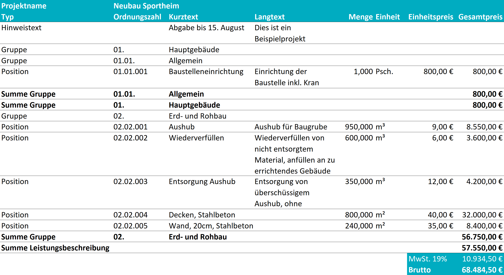
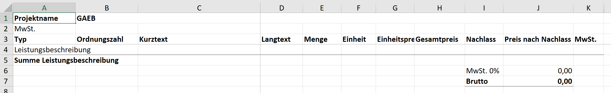
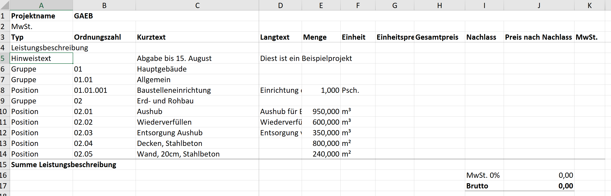
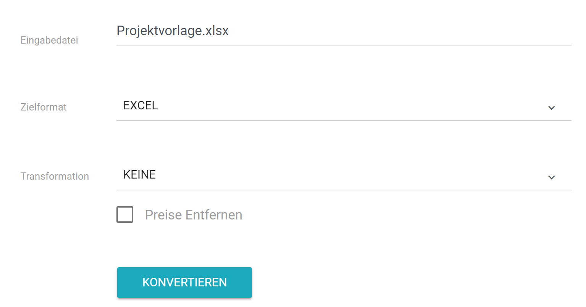
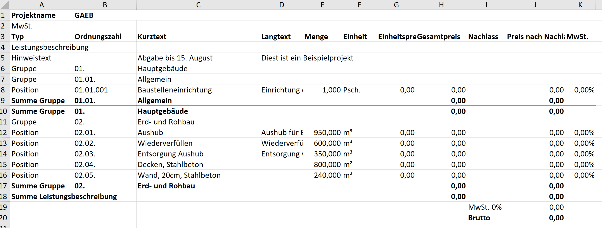
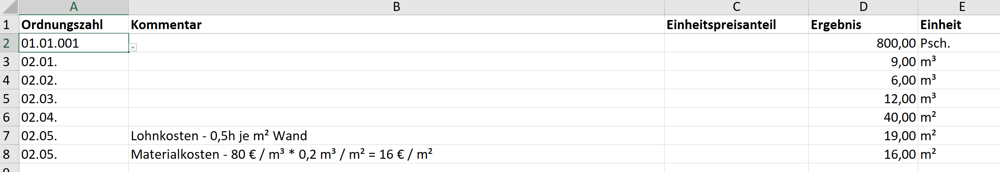
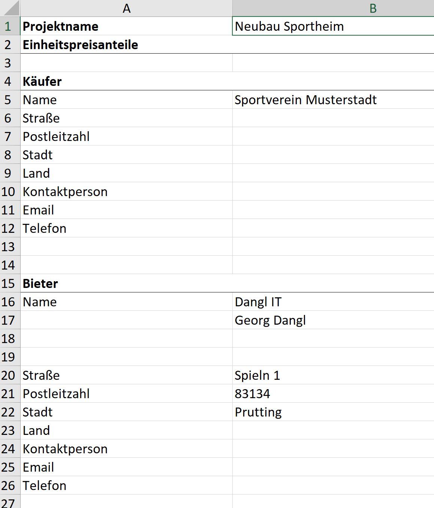
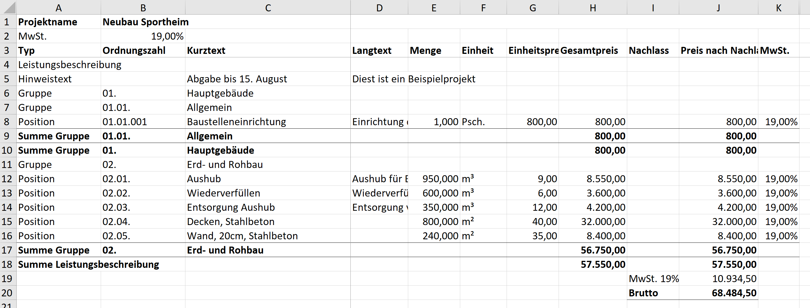
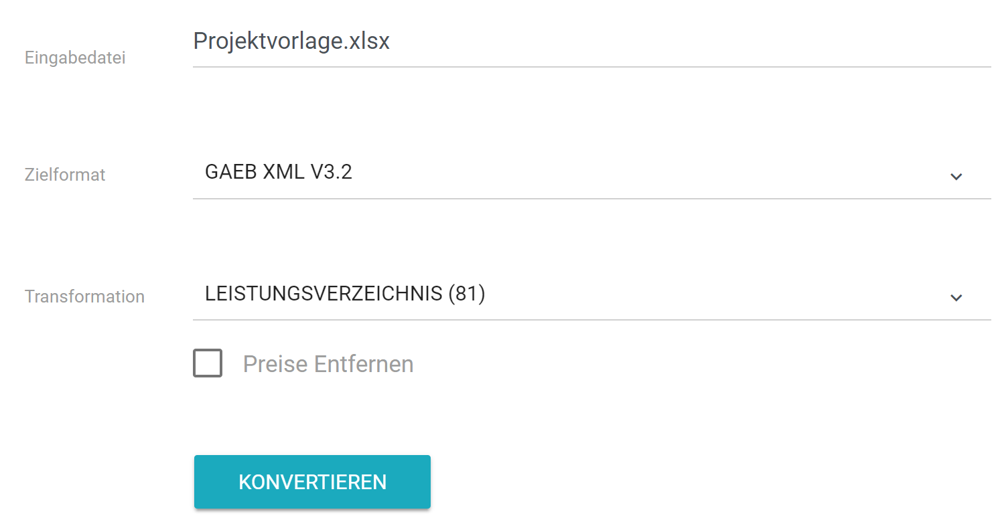

# Praxisbeispiel - Erstellen eines neuen Projekts

In diesem Abschnitt lernen Sie, wie Sie das Beispielprojekt aus dem [Artikel Was ist GAEB?](https://www.dangl-it.de/artikel/was-ist-gaeb/) mittels Excel in WebGAEB erstellen. Sie können das Beispielprojekt [direkt hier herunterladen](https://www.dangl-it.de/media/1031/gaeb-bundle-de.zip), es enthält alle GAEB Formate sowie die Excel Datei.

## Das Beispielprojekt

Zur Erinnerung, so sieht das Beispielprojekt aus:

Es handelt sich um den vereinfacht dargestellten Neubeu eines Sportheims mit einigen Positionen und einem Hinweistext zu Beginn.

## Herunterladen der Projektvorlage

Gehen Sie auf die [Startseite von Web**GAEB**](https://www.web-gaeb.de) und laden Sie mit einem Klick auf _Excel Vorlage_ die leere Projektvorlager herunter. Alternativ können Sie [direkt hier klicken](https://www.web-gaeb.de/GaebConversion/GetSampleExcelProject).

Nach dem Öffnen der Datei sehen Sie folgendes:

> Hinweis: Sie müssen Möglicherweise die Sicherheitsabfrage in Excel bestätigen um zu erlauben, dass die aus dem Internet heruntergeladene Datei bearbeitet werden kann.

## Fügen Sie Elemente Hinzu

Fügen Sie zuerst einige leere Zeilen zwischen _Leistungsbeschreibung_ und _Summe Leistungsbeschreibung_ ein. Hier werden nun die Hinweistexte, Positionen und Gruppen eingetragen. Ebenfalls werden gleich die Texte, die Mengen sowie die Mengeneinheiten eingetragen. Ihre Datei sollte nun so aussehen:

Speichern Sie nun die Datei.

> Hinweis: Bitte achten Sie darauf, die entsprechenden Werte in der Spalte _Typ_ einzutragen. Weitere Infos dazu unter [Elemente Hinzufügen](./elemente_hinzufuegen.md).

## Preise Ausfüllen

Um die Preise für das Projekt zu kalkulieren haben Sie zwei Möglichkeiten:
1. Sie können direkt in die Spalte _Einheitspreis_ schreiben.
2. Sie schicken das Projekt an Web**GAEB**, wählen als Ziel Excel aus, und ermöglichen sich so die Nutzung des Kalkulationsblattes.

Folgender Abschnitt zeigt Ihnen, wie Sie die zweite Variante _mit Kalkulationsblatt_ durchführen.

Gehen Sie wieder auf die [Startseite von Web**GAEB**](https://www.web-gaeb.de), wählen Sie die soeben ausgefüllte Datei _Projektvorlage.xlsx_ aus und konfigurieren Sie als Ziel wieder _Excel_. Klicken Sie anschließend auf Konvertieren.

Nach dem Öffnen der der Datei sehen Sie, dass Web**GAEB** die Gruppensummen hinzugefügt hat sowie die Kalkulationsformeln für Preise.

Es geht nun weiter im Blatt _Kalkulation_.

## Kalkulationsdaten Ausfüllen

Im _Kalkulationsblatt_ finden Sie bereits einige vorausgefüllte Daten. Um nun Preise für Ihre Positionen zu kalkulieren, gehen Sie wie folgt vor:
1. Wählen Sie in Spalte _A_ die Ordnungszahl der Position aus, die Sie erfassen möchten.
2. Tragen Sie Ihre Berechnung in Spalte _D - Ergebnis_ ein. Sie können alle Funktionen und Formeln von Excel verwenden.
2. Zu Ihrer Unterstützung können Sie einen Kommentar in Spalte _B_ einfügen, der Ihre Berechnung unterstützt. So können Sie z.B. die Position der Stahlbetonwand in mehreren Teilen Kalkulieren, etwa mit Lohnanteil und Materialkosten.

> Falls Sie sich fragen, was es mit Spalte _C - Einheitspreisanteil_ auf sich hat: Diese Spalte können Sie beim Erfassen von neuen Projekten ignorieren. Wenn Sie jedoch eine Ausschreibung aus einer GAEB Datei heraus beginnen, dann kann es sein, dass der Auftraggeber verlangt, Preiskalkulationen nach Kostenarten bzw. Einheitspreisanteilen aufzugliedern. Überlicherweise werden Teile wie _Lohnkosten_, _Material-_ und _Gerätekosten_ verwendet.

Nach dem Ausfüllen sollte Ihr Kalkulationsblatt so aussehen:

Mit einem kurzen Blick auf das Übersichtsblatt _GAEB_ sehen Sie, dass nun alle Preise im Leistungsverzeichnis vorhanden sind.

## Projektdaten Eintragen

Um die Erstellung der Leistungsbeschreibung abzuschließen möchten Sie nun noch Käufer- und Bieterinformationen hinzufügen sowie einen Projektnamen vergeben. Wechseln Sie dazu in das Arbeitsblatt _Projektinfo_ und füllen Sie die Felder wie folgt aus:

## Kalkulation Abschließen

Zurück im Übersichtsblatt sehen Sie nun alle Daten wie von Ihnen eingetragen. Es fehlt nur noch die Mehrwertsteuer.
Diese tragen Sie ganz einfach in Zelle _B2_, direkt unter dem Projektnamen, ein.

> Tipp: Haben einzelne Positionen einen abweichenden Mehrwertsteuersatz, z.B. Bauwasser oder auch Lebensmittel, können Sie diesen direkt in der Position selbst eintragen.

Das Projekt sieht nun wie folgt aus:

## Export nach GAEB

Möchten Sie nun Ihr Projekt nach GAEB exportieren, um es Ihrem Auftraggeber zu übermitteln? Gehen Sie einfach wieder [zurück zu Web**GAEB**](https://www.web-gaeb.de) und exportieren das Projekt in eines der GAEB Formate, z.B. GAEB XML 3.2. Abhängig von Ihrem Anwendungsfall können Sie noch eine Transformation in eine bestimmte Phase durchführen, z.B. _Phase 81_ zur Übergabe allgemeiner Projektdaten oder _Phase 84_ zur Abgabe eines Angebots.

**Glückwunsch!** Sie haben soeben Ihr erstes Projekt mit Web**GAEB** erzeugt!

Haben Sie Fragen? [Bitte kontaktieren Sie uns](https://www.dangl-it.de/kontakt/?message=Ich+möchte+mehr+über+WebGAEB+erfahren.+Bitte+kontaktieren+Sie+mich.)!
